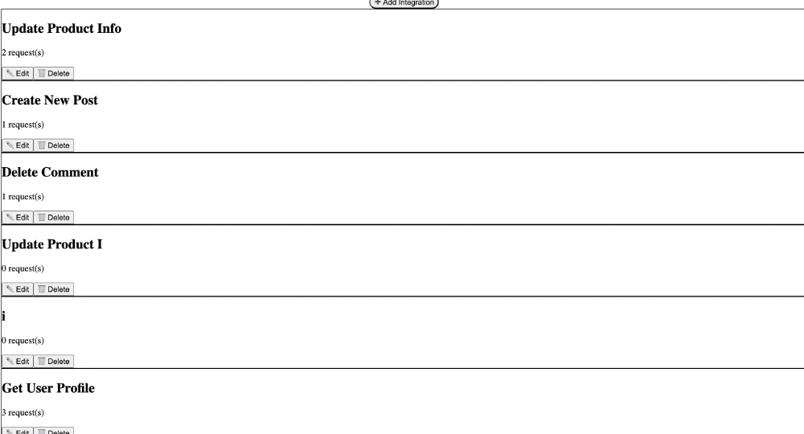

#  CurlUI

**CurlUI** is a lightweight Postman-style tool for designing and executing API workflows — built with .NET Core 9 and React + TypeScript.
Create collections of API requests, define data flows with placeholders, and view pretty responses with ease.

---

##  Features

*  Create, edit, and delete **Integrations** (API collections)
*  Replace `{{placeholders}}` with:

  * Manual input at runtime
  * Extracted values from earlier responses (JSONPath)
*  Supports method, URL, headers, body for each request
*  Add `Bearer` token support
* Run integrations **sequentially** and view:

  * Status codes
  * Response times
  * Pretty-printed JSON
*  Swagger UI for all backend endpoints
*  70% test coverage with xUnit + mocks
*  Docker & Makefile support

---

##  Preview


###  Home Page – View All Integrations


---

###  Integration Editor – Create and Edit Requests


---

###  Request Editor – Customize Method, Headers, Body



###  Creating an Integration
---

##  Tech Stack

| Layer     | Stack                                 |
| --------- | ------------------------------------- |
| Frontend  | React (TypeScript), TailwindCSS, Vite |
| Backend   | .NET Core 9, EF Core, SQLite          |
| Testing   | xUnit, Mock HTTP Handler              |
| Packaging | Docker, Makefile                      |

---

##  Get Started

###  Docker (Recommended)

```bash
git clone https://github.com/Tosinolade1/CurlUI.git
cd CurlUI
docker compose up --build
```

Then visit:

*  Frontend → [http://localhost:5173](http://localhost:5173)
*  Backend API → [http://localhost](http://localhost)
*  Swagger → [http://localhost/swagger](http://localhost/swagger)

To stop:

```bash
docker compose down
```

---

### Manual Setup (No Docker)

#### Backend

```bash
cd Backend
dotnet restore
dotnet ef database update
dotnet run
```

#### Frontend

```bash
cd frontend
npm install
npm run dev
```

---

###  Using the Makefile

```bash
make build             # Backend build
make run               # Run backend
make frontend-build    # Frontend build
make frontend-run      # Run React dev server
make test              # Run backend tests
```

---

## Testing

```bash
cd Backend
dotnet test
```

Covers:

* ✅ Request execution logic
* ✅ IntegrationRunner
* ✅ Service methods
* ✅ JSONPath extraction
* ✅ Mocked external calls

---

## Project Structure

```
CurlUI/
├── Backend/
│   ├── Controllers/
│   │   ├── IntegrationController.cs
│   │   └── RequestItemsController.cs
│   ├── Models/
│   │   ├── Integration.cs
│   │   ├── RequestItem.cs
│   │   ├── RunRequest.cs
│   │   └── RunResultDto.cs
│   ├── Services/
│   │   ├── IntegrationRunner.cs
│   │   └── IntegrationService.cs
│   ├── Data/
│   ├── ApiIntegrationUtility.Tests/
│   │   ├── IntegrationRunnerTests.cs
│   │   ├── IntegrationServiceTests.cs
│   │   └── MockHttpMessageHandler.cs
│   └── Program.cs
├── frontend/
│   ├── Dockerfile
│   ├── src/
│   │   ├── components/
│   │   │   └── IntegrationCard.tsx
│   │   ├── pages/
│   │   │   ├── Home.tsx
│   │   │   ├── IntegrationEditor.tsx
│   │   │   └── RequestEditor.tsx
│   │   ├── utility/
│   │   │   └── api.ts
│   │   └── types/
│   │       └── types.ts
├── docker-compose.yml
├── Dockerfile
├── Makefile
├── screenshots
├── README.md


```

---

## Postman Sample

Import the sample below to test a pre-built integration:

📄 [`sample.postman_collection.json`](./sample.postman_collection.json)

---

## Author

**Mercy Oladejo**

